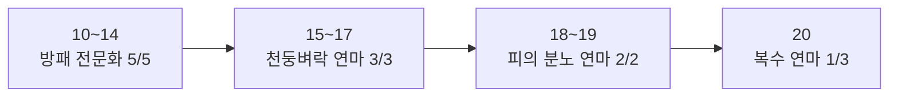

# 드워프 방어 전사 1~20 공략 (포에버)

> 최종 수정: 2026-10-07

!!! abstract "한눈에 보기"
    - 무기: 한손 무기 + 방패. 비슷하면 한손 둔기(드워프 둔기 전문화)
    - 특성: 방어 0/0/11. 방패 전문화 → 천둥벼락 연마 → 피의 분노 연마 → 복수 연마
    - 태세: 방어 태세 기본, 돌진할 때만 전투 태세(25레벨 Vanguard 전까지)
    - 10레벨 방어 태세 직업 퀘스트는 필수
    - 던전: 영주의 전당(13~18), 죽음의 폐광(17~26)
    - 전문기술: 채광 + 대장기술, 보조로 요리

## 개요

드워프 방어 전사는 20레벨까지 한손 둔기 + 방패를 들고 방어 트리에 11포인트를 전부 넣는 게 기본이다.

!!! info "서버 일정"
    WoW Forever는 오리지널 기반의 클래식+ 서버로 11월 4일 정식 출시 예정이다. 베타는 9월 17일 열렸고 현재 만렙은 30(10월 1일 상향)이며, 베타 캐릭터는 출시 전 초기화된다.

- **드워프 레이셜**: 석화(출혈·독·물리 피해 감소, Forever에서 개편), 둔기 전문화(둔기 치명타 +1%). 냉기 저항 레이셜은 빠졌다.
- **무기**: 한손 무기 + 방패. 드워프는 둔기를 들면 레이셜 효과가 붙으니 비슷하면 한손 둔기를 고른다. 무기 숙련도가 낮은 새 무기는 빗나감이 많으니 바꾼 뒤 숙련도를 올린다.
- **방패**: 방어도와 방패 막기 확률이 높은 것. 방패 전문화 특성과 16레벨 방패 막기가 방패에 의존한다.
- **스탯 우선순위(레벨업)**: 무기 공격력 > 적중 > 방어도 > 체력 > 민첩 > 치명타 > 힘.
- **태세**: 방어 태세가 기본이고, 돌진할 때만 전투 태세로 바꾼다. 방어 트리 4단 신규 특성 Vanguard를 찍으면(25레벨부터) 방어 태세에서도 돌진이 된다.
- **공통 변경**: 연전연승(Victory Rush)이 기본 기술이 됐고, 전술 숙련도 기본 기능이 됐다. 방패의 벽·무모한 희생 같은 큰 쿨기는 15분으로 줄었다.

!!! tip "아이템은 수치로 비교"
    Forever는 아이템 스탯이 바뀌어서 고급(초록) 아이템이 희귀(파랑)보다 나을 때가 있다. 등급보다 수치를 직접 비교한다.

!!! tip "퀘스트 구간은 무기 특성도 가능"
    방어 특성은 혼자 퀘스트할 때 사냥이 느리다. 퀘스트 위주 구간은 무기 특성으로 올리고 던전 갈 때만 바꾸는 방법도 있다(베타 특성 초기화 1실버).

## 특성

20레벨까지 11포인트를 전부 방어에 넣는 **0/0/11** 빌드를 추천한다. 특성 포인트는 10레벨부터 레벨당 1개씩 받고, 트리는 5포인트마다 다음 단이 열리므로 아래 순서대로 찍으면 된다.



| 레벨 | 특성 | 효과 |
| --- | --- | --- |
| 10~14 | 방패 전문화 5/5 (1단) | 방패 막기 확률 +5%, 막을 때 20% 확률로 분노 생성. 방패 막기를 분노 손해 없이 쓸 수 있게 해준다 |
| 15~17 | 천둥벼락 연마 3/3 (2단) | 천둥벼락 분노 소모 감소. 방어 태세에서 쓸 수 있는 광역 위협 기술 |
| 18~19 | 피의 분노 연마 2/2 (2단) | 피의 분노 분노 생성 증가. 초반 분노 부족 해결 |
| 20 | 복수 연마 1/3 (3단) | 복수 피해 +20%. 복수가 가장 강한 단일 위협 기술이라 1포인트 효율이 가장 좋다 |

- **20번째 포인트**: 복수 연마를 추천한다. 대안은 3단 신규 특성 Master of Defense(회피·무기 막기 시 분노 5)지만, 20레벨 전사는 회피율이 10% 안팎이라 아직 효과가 작다. 게임에서는 3단 아이콘과 효과 설명으로 찾는다.
- **레거시 Talented 특전**: 계정 공유 성장 시스템인 레거시(Legacy)의 Talented 특전을 찍으면 특성 포인트를 9레벨부터 받아서 최대 3점을 더 쓸 수 있다. 이때는 복수 연마를 3/3까지 채우고 남는 1점은 Master of Defense나 최후의 저항에 넣는다.
- 돌진은 25레벨 Vanguard 전까지 전투 태세에서만 된다. 천둥벼락은 방어 태세에서 쓸 수 있다.

### 21~30 계획

| 레벨 | 특성 | 메모 |
| --- | --- | --- |
| 21~22 | 복수 연마 3/3 | |
| 23~24 | 도전(Defiance) 2/3 | 방어 태세 + 방패 착용 시 위협 수준 증가. Forever에서 5랭크가 3랭크로 줄었다 |
| 25 | Vanguard 1/1 (4단, 신규) | 방어 태세에서 돌진 가능. 태세 전환이 사라진다 |
| 26 | 도전 3/3 | |
| 27~30 | Master of Defense 2/2 + 강인함(Toughness) 2/5 | 회피가 늘어나는 구간부터 Master of Defense 가치가 올라간다 |

### 60레벨 예상 빌드

- **방어 43 / 분노 8**: 방어 트리 끝의 방패 밀쳐내기(Shield Slam), 신규 Bastion(방패 착용 시 피해 +10%), Focused Rage(공격 기술 분노 감소), Vitality, 최후의 저항, 방패의 벽 연마.
- 분노 8포인트는 무자비함(Cruelty) 5/5 + Unbridled Wrath 3/5로 치명타와 분노를 보강한다.

!!! warning "게임에서 확인 필요"
    60레벨은 아직 베타에서 열리지 않아 이론상 빌드다.

## 단축키와 매크로

솔플·던전 모두 이 배치를 그대로 쓴다. 전사는 태세를 바꾸면 게임이 기본 바를 그 태세 전용 줄로 바꾼다. 그래서 전투 태세와 방어 태세 줄을 따로 채우고, 같은 키에 비슷한 역할을 둔다. 위 두 줄은 태세와 상관없이 그대로다.

**칸마다 기능 하나**를 둔다. 기본 바 위로 두 줄을 쌓고, 같은 열은 같은 키에 수정키만 다르다. 단축바만 봐도 어떤 키에 무엇이 있는지 보인다.

- **기본 바**: 1~5, Q E R F G Z T
- **한 칸 위(2번 바)**: 알파벳 열은 Shift. 전사는 Ctrl 칸을 쓰지 않는다.
- **두 칸 위(3번 바)**: Alt + 같은 키
- **2번 바 왼쪽 작은 5번 바**: 따라치기(`` ` ``), 공격대 표시(Caps Lock / Alt+Caps / Ctrl+Caps), 단축키 표를 여는 ? 버튼. 모든 캐릭터 공용이다.
- **Shift+숫자**는 쓰지 않는다. WoW 기본 단축바 넘기기(Shift+1~6)는 지운다. Alt+Shift 조합은 한글 입력 전환과 겹쳐 쓰지 않는다.
- 쓰지 않는 칸은 숨겨서 자리만 남는다.

| 열 | 1 | 2 | 3 | 4 | 5 | Q | E | R | F | G | Z | T |
| --- | --- | --- | --- | --- | --- | --- | --- | --- | --- | --- | --- | --- |
| Alt | 분쇄 | - | - | - | 석화(드워프) | - | - | - | - | - | - | - |
| Ctrl·Shift | - | - | - | - | - | Shift: 도전의 외침(26) | Shift: 풀링 알림 | Shift: 위협의 외침(22) | Shift: 무장 해제(18) | Shift: 최후의 저항(특성) | - | Shift: 방패의 벽(28) |
| 기본: 방어 태세 | 복수(14) | 방어구 가르기 | 천둥벼락 | 방패 가격(마우스오버) | 방패 막기(16) | 도발(10, 마우스오버) | 전투 태세 | 사기의 외침(14) | 영웅의 일격 | 연전연승 | 전투의 외침 | 피의 분노(10) |
| 기본: 전투 태세 | 영웅의 일격 | 방어구 가르기 | 천둥벼락 | 방패 가격(마우스오버) | 제압(12) | 방어 태세(10) | 돌진 | 사기의 외침(14) | - | 연전연승 | 전투의 외침 | 피의 분노(10) |

괄호 숫자는 배우는 레벨이다. 아직 안 배운 칸은 비워 둔다.

- **돌진 풀링**: 방어 태세에서 E로 전투 태세로 바꾸고 E를 한 번 더 눌러 돌진한다. 몹에 닿으면 Q로 방어 태세로 돌아간다. 그 뒤 Q는 도발이다.
- 10레벨 방어 태세 전에는 전투 태세 줄만 쓴다.
- 1과 2는 자동 공격을 같이 켠다.

!!! tip "자동 설정 애드온"
    WcfSetup 애드온을 쓰면 아래 매크로, 칸 배치, 단축키, 편집 모드의 바 위치까지 `/wcfsetup` 한 번으로 끝난다. 이어서 `/reload`를 입력한다. 새 기술을 배우면 다시 `/wcfsetup`을 입력하고, 배치는 5번 바의 ? 버튼이나 `/wcfkeys`로 여는 단축키 표에서 바로 볼 수 있다. 애드온 없이 하려면 아래 매크로를 만들고 [설정 순서](#설정-순서)대로 놓는다.

### 매크로

기술을 그대로 놓는 칸은 매크로가 필요 없다. 자동 공격이나 마우스오버가 필요한 칸만 매크로다. 이름이 안 먹으면 매크로 창을 연 채 주문서에서 기술을 Shift+클릭해 넣는다.

**1 복수 (방어 태세)**: 막기·회피·무기 막기 후 켜지는 주력 위협 기술이다. 전투 태세 1의 영웅의 일격도 같은 매크로에서 이름만 바꾼다.

```
#showtooltip 복수
/startattack
/cast 복수
```

**2 방어구 가르기**:

```
#showtooltip 방어구 가르기
/startattack
/cast 방어구 가르기
```

**4 마우스오버 방패 가격**: 대상을 바꾸지 않고 마우스를 올린 몹의 시전을 끊는다.

```
#showtooltip
/cast [@mouseover,harm,nodead][] 방패 가격
```

**Q 마우스오버 도발 (방어 태세)**: 힐러나 딜러에게 간 몹에 마우스를 올리고 누른다.

```
#showtooltip
/cast [@mouseover,harm,nodead][] 도발
```

- 영웅의 일격(방어 태세 F)은 다음 평타에 예약되는 기술이라 전역 재사용 대기가 없다. 분노가 남을 때 복수·방어구 가르기와 같이 누른다.
- 광역 위협은 피의 분노(T)로 분노를 채우고 천둥벼락(3)이다.
- Vanguard를 찍으면 방어 태세에서도 돌진이 된다. 그때는 방어 태세 E에 돌진을 직접 놓는다.

### 설정 순서

애드온을 쓰면 1~4는 자동이다.

1. ESC → 단축키 설정에서 Shift+1~6(단축바 넘기기)을 지우고, Q·E의 옆걸음을 단축바 키로 바꾼다.
2. ESC → 설정 → 액션바에서 2번·3번·5번 바를 켠다. 편집 모드에서 2번·3번 바를 가로 1줄 12칸으로 바꿔 기본 바 위에 차례로 쌓고, 5번 바는 2번 바 왼쪽에 둔다. "항상 버튼 표시"는 끈다.
3. 전투 태세에서 위 표의 Alt, Shift, 전투 태세 줄을 놓는다. 방어 태세로 바꿔 기본 바에 방어 태세 줄을 놓는다. 같은 열이 같은 키라 위아래 줄을 맞춘다.
4. 단축키 설정에서 2번 바 1~4칸에 Ctrl+1~4, 6~12칸에 Shift+Q·E·R·F·G·Z·T, 3번 바에 Alt+같은 키, 5번 바에 `` ` ``·Caps Lock·Alt+Caps·Ctrl+Caps를 지정한다. 
5. 매크로가 안 먹으면 매크로 창을 연 채 주문서나 가방에서 이름을 Shift+클릭해 넣는다. 문법은 [포에버 매크로 교본](../tools/macro-guide.html)과 같다.

!!! warning "게임에서 확인 필요"
    - 전투·방어 태세의 기본 바가 클래식과 같은 칸 번호를 쓰는지 미확인이다. 애드온을 쓴 뒤 태세를 바꿨을 때 기본 바가 비어 있으면 그 태세에서 직접 놓는다.
    - 도전의 외침, 위협의 외침, 무장 해제, 분쇄, 연전연승의 한글 이름은 미확인이다. 애드온이 "아직 안 배운 기술"로 알려 주면 주문서에서 끌어다 놓는다.

## 장비

드워프 탱커의 20레벨 목표는 한손 무기 **Butcher's Slicer**와 방패 **Crest of Darkshire**다. 목표 장비를 구하기 전에는 영주의 전당·죽음의 폐광 드랍과 20레벨 전사 직업 퀘스트 장비로 버틴다. 탱커는 방어도와 체력이 먼저고 그다음 방어 숙련도다.

### 초반 (드랍 무기 전)

- 시작 무기는 양손 둔기라, 상인에게 한손 둔기와 방패를 사서 바로 바꾼다. 콜드리지 골짜기나 카라노스 무기·방어구 상인의 흰 템도 충분하다.
- **퀘스트 보상**: 던 모로·모단 호수 보상 중 한손 둔기, 방패, 사슬 방어구(10레벨부터 사슬)를 고른다. 가죽보다 사슬 방어도가 훨씬 높다.
- **제작템**: 대장기술로 만든 사슬 방어구(Guard's·Veteran's 계열)가 경매장에 싸게 올라오면 산다.
- 무기를 바꾸면 그 무기 숙련도를 올려야 빗나감이 줄어든다. 둔기 → 둔기처럼 같은 종류로 바꾸면 편하다.

### 20레벨 BiS (얼라이언스)

| 부위 | 아이템 | 종류 | 얻는 곳 |
| --- | --- | --- | --- |
| 무기 1순위 | Butcher's Slicer | 한손 도끼 | 그림자송곳 성채, 도살자 라자클로 (41.95%) |
| 무기 2순위 | Gutterblade | 한손 무기 | 잿빛 골짜기 퀘스트 Raene's Cleansing (18+) |
| 무기 (가까운 대안) | Durgen's Crescent Axe | 한손 도끼 | 영주의 전당, 두르겐 더지해머 |
| 방패 1순위 | Crest of Darkshire | 방패 | 그늘숲 퀘스트 Bride of the Embalmer (20+) |
| 방패 2순위 | Arctic Buckler | 방패 | 검은심연 나락 퀘스트 Blackfathom Villainy (18+) |
| 가슴·다리·손 | Fire Hardened Hauberk·Leggings·Gauntlets | 사슬 | 20레벨 얼라이언스 전사 직업 퀘스트 (Furen's·Mathiel's Armor 등) |
| 가슴 (던전) | Golemguard Chest | 사슬 | 영주의 전당, 플런더 |
| 허리·발 (던전) | Kindlegem Girdle, Treads of the Protector Golem | 사슬 | 영주의 전당, 마그마투스·플런더 |
| 손목 | Beetle Clasps | 사슬 | 퀘스트 |
| 반지 | Seal of Wrynn | 반지 | 퀘스트 |
| 매달이 | Minor Recombobulator, Lookie's Spyglass | 장신구 | 기계공학 / 죽음의 폐광 |

!!! tip "현실적인 20레벨 세팅"
    그림자송곳 성채와 검은심연 나락은 원래 20레벨 이후 던전이고 드워프 동선에서 멀다. 영주의 전당 사슬 장비 + Durgen's Crescent Axe를 20레벨 세팅으로 보고, 1·2순위는 30레벨 개방 후 목표로 둔다.

- 죽음의 폐광에서는 밴클리프의 Cruel Barb(한손검)도 탱커가 쓸 만하다. 감시병 언덕 데피아즈 퀘스트 마지막 보상은 사슬 다리 Chausses of Westfall을 고른다.
- 드워프는 둔기 치명타 +1%가 있지만, 탱커는 무기 자체 성능이 더 중요하다. 위 목록은 도끼·검이라도 둔기보다 좋으면 그대로 쓴다.
- 아이템 이름은 영문 그대로 적었다(한글명 미확인). 베타 초기 목록이라 순위·드랍처는 바뀔 수 있다.

## 입찰과 차비

방어 전사는 사슬 방어구, 한손 무기, 방패가 입찰 대상이다. 파티에 탱커는 보통 한 명이라 방어 장비는 거의 다툼 없이 가져간다.

| 아이템 | 선택 |
| --- | --- |
| 사슬 방어구 (힘·체력·방어도·민첩) | 입찰. 10~39레벨 전사의 주 방어구다 |
| 가죽 방어구 (힘·민첩·체력) | 차비. 지금 사슬보다 크게 좋고 도적·드루이드·주술사·사냥꾼이 입찰하지 않을 때만 물어보고 입찰 |
| 천 방어구 | 차비 |
| 방패 | 입찰. 성기사·주술사와 겹치면 방어도·체력 방패는 탱커 우선이 관례 |
| 한손 도끼·둔기·도검 (힘·체력, 높은 최대 피해) | 입찰 |
| 양손 무기 | 차비. 필드에서 무기 전사로 키울 계획이면 시작 전에 말해 둔다 |
| 활·총·석궁·투척 | 사냥꾼이 있으면 차비. 당기기용이라 성능 차이가 작다 |
| 목·반지·망토 (힘·체력·방어도) | 입찰. "곰의"·"원숭이의"·"호랑이의" 접미사가 전사 템이다 |
| 대장기술 도면 | 바로 배울 수 있으면 시작 전에 말하고 입찰, 아니면 차비 |

- 전사는 거의 모든 무기를 들 수 있어서 무기 다툼이 잦다. 지금 무기보다 확실히 나을 때만 입찰한다. 드워프는 둔기 치명타 +1%가 있지만 성능이 더 좋은 도끼·도검이면 그대로 입찰한다.
- 사슬 방어구는 주술사·사냥꾼도 40레벨부터 입는다. 30레벨 구간까지 사슬은 사실상 전사·성기사 몫이다.
- 탱커가 파티를 모으는 경우가 많다. 모을 때 "그룹 획득, 고급 기준"처럼 분배 방식을 먼저 정해 두면 뒤에 다툴 일이 없다.

!!! info "포에버 주사위 규칙"
    - 그룹 획득에서 고급(초록) 이상이 나오면 주사위 창이 뜬다. 입찰한 사람이 한 명이라도 있으면 차비한 사람은 가져갈 수 없다.
    - 입찰은 **지금 이 특성으로 바로 입는 업그레이드**일 때만 누른다. 부캐용·판매용·마력 추출용은 차비, 필요 없으면 포기.
    - 던전에서 나온 고급·희귀 획득 시 귀속 장비의 외형은 주울 자격이 있던 파티원 모두에게 등록된다. 외형 때문에 입찰하지 않는다.
    - 적중·치명타는 근접·주문 구분 없이 한 스탯이다. 적중·치명타만 보고 판단하지 말고 주 능력치(힘·민첩·지능)로 누구 템인지 정한다.
    - 착용 시 귀속 파란색·보라색은 전원 차비가 기본이다. 바로 입을 업그레이드면 굴리기 전에 채팅으로 물어본다.
    - 툴팁에서 Shift를 누르면 지금 장비와 나란히 비교된다. 이름 아래 줄의 "획득 시 귀속"/"착용 시 귀속"으로 귀속 방식을 본다.

## 육성 루트

콜드릿지 계곡 → 던 모로 → 모단 호수 + 영주의 전당 → 서부 몰락지대·붉은마루 산맥 + 죽음의 폐광 순서가 무난하다.

!!! info "10레벨 방어 태세 퀘스트"
    전사는 10레벨 방어 태세 직업 퀘스트를 꼭 해야 탱킹을 시작할 수 있다.

| 레벨 | 지역 | 할 일 |
| --- | --- | --- |
| 1~5 | 콜드릿지 계곡 | 계곡 퀘스트 전부. 바로 한손 둔기 + 방패로 바꾼다 |
| 6~10 | 던 모로, 카라노스 | 서리갈기 트롤 줄기, 웬디고 동굴(The Grizzled Den), 카라노스 퀘스트 |
| 10 | 카라노스 → 아이언포지 | 방어 태세 직업 퀘스트 (아래 참고), 피의 분노·도발 훈련 |
| 10~13 | 모단 호수 | 텔사마르 비행 경로·귀환 장소, 트로그 처치, 광산 퀘스트 |
| 13~15 | 영주의 전당 | 아이언포지 지하 신규 던전. 퀘스트를 다 받아서 탱커로 한 번 |
| 15~17 | 모단 호수 | 아이언밴드 발굴지 등 남은 퀘스트 정리. 14에 복수·사기의 외침, 16에 방패 막기 훈련 |
| 17~20 | 서부 몰락지대 또는 붉은마루 산맥 | 깊은굴 지하철로 스톰윈드. 감시의 언덕 데피아스 줄기 받고 죽음의 폐광 |
| 20 | 붉은마루 산맥 레이크샤이어 | 화염에 단련된 갑옷 직업 퀘스트 시작 (30 개방 후까지 이어짐) |

### 전사 직업 퀘스트

- **10레벨 방어 태세**
    1. 카라노스 전사 조련사 Granis Swiftaxe에게 Muren Stormpike 퀘스트를 받는다.
    2. 아이언포지 군사 지구의 Muren에게 가서 Vejrek 처치 퀘스트를 받는다.
    3. Brewnall 마을 남쪽의 Vejrek을 잡아 머리를 가져간다.
    4. 보상: 방어 태세, 방어구 가르기, 도발.
- **20레벨 화염에 단련된 갑옷(Fire Hardened)**
    1. 레이크샤이어의 Yorus Barleybrew에게 The Rethban Gauntlet을 받는다.
    2. 스톰윈드 드워프 지구의 Furen Longbeard(The Shieldsmith)로 이어진다.
    3. 가슴·다리·손 등 사슬 탱템을 준다. 뒷단계는 20레벨대 몹이라 30 개방 후 마무리하는 게 편하다.

### 탱커 육성 팁

- 혼자 퀘스트할 때는 무기 특성(분쇄 연마·재빠른 손놀림·제압 연마)으로 올리다가 던전 전에 방어로 초기화하는 방법도 있다. 베타 초기화는 1실버이고, 연달아 바꾸면 1시간 동안 비싸진다.
- 방어 특성으로 혼자 다닐 때는 여러 마리를 모아 천둥벼락으로 잡으면 속도 차이가 줄어든다. 연전연승으로 전투 사이 휴식 시간도 줄인다.
- Forever는 던전 몹 경험치가 줄고 경험치가 던전 퀘스트로 옮겨갔다. 던전은 관련 퀘스트를 다 받아둔 상태로 한 번 도는 게 핵심이다.

!!! tip "20레벨 퀘스트 쌓아두기"
    20레벨이 되면 끝낸 퀘스트는 반납하지 말고 쌓아두었다가 30 개방 직후 한꺼번에 반납한다.

퀘스트 세부 목록과 하고 버릴 퀘스트는 [얼라이언스 1~20 육성 동선](../tools/alliance-leveling.html)의 드워프·노움 항목과 같다. NPC·퀘스트 이름은 영문 그대로 적었다(한글명 미확인).

## 던전

20레벨까지 드워프 탱커가 갈 던전은 영주의 전당(13~18)과 죽음의 폐광(17~26) 두 곳이다. 둘 다 5인 기준이고 자동 파티 찾기가 거의 없어서 채팅 채널이나 길드로 모은다. 탱커는 파티가 잘 안 나오는 역할이라 모집 글을 올리면 금방 차는 편이다.

| 던전 | 레벨 | 위치 | 가는 법 |
| --- | --- | --- | --- |
| 영주의 전당 | 13~18 | 아이언포지 지하(옛 아이언포지) | 왕좌(The High Seat) 왼편 통로 → 돌길을 따라 입구 |
| 죽음의 폐광 | 17~26 | 서부 몰락지대 문브룩 | 깊은굴 지하철 → 스톰윈드 → 서부 몰락지대 남쪽 문브룩 폐광 안쪽 |

### 파티 구성

기본은 탱커(나) 1, 힐러 1, 딜러 3이다.

- **힐러**: 사제 추천. 영주의 전당은 언데드·유령이 많아서 20레벨 언데드 속박이 쓸모 있다. 성기사도 가능하다.
- **딜러**: 법사는 드워프·데피아스 같은 인간형에 변이를 걸 수 있다. 도적은 압박이, 흑마법사는 공포·소환수 차단이 있다. 드루이드·성기사의 가시 효과는 탱커 위협 수준에 도움이 된다.
- 사슬 장비는 전사·사냥꾼·주술사가 같이 쓴다. 파티를 짤 때 주사위 규칙(주 역할 우선 등)을 먼저 말해두면 편하다.

### 영주의 전당

들어가기 전에 아이언포지에서 The Restless Dead(Afadra Dunwall), Important Heirlooms(Thom Filch)를 받는다. 안에서는 서쪽 전당의 유령 시종에게 An Ancient Grudge를 받고, 검은무쇠 드워프가 떨구는 지도로 Old Ironforge Incursion이 시작된다.

| 보스 | 탱커가 할 일 | 탱커 드랍 |
| --- | --- | --- |
| 파람드림 앤빌마 | 돌이 되는 저주(공격 속도 -20%)가 퍼지지 않게 어그로를 확실히 잡는다 | - |
| 마그마투스 | 360도 광역 공격이 있어 파티에서 떼어서 잡는다. 앞 쓰레기의 다이너마이트 기술자·화염구 소환사는 시야를 꺾어 끌어모은다 | Kindlegem Girdle (사슬 허리) |
| 플런더 | 무작위 돌진 + 기절로 대상이 바뀐다. 바로 도발로 되찾고, 통로로 끌고 와서 잡으면 돌진·넉백이 편해진다 | Golemguard Chest (사슬 가슴), Treads of the Protector Golem (사슬 발) |
| 두르겐 더지해머 | 돌 골렘 2마리와 같이 나온다. 천둥벼락으로 어그로를 잡고, 출혈은 석화로 지운다. 광역 공포가 있어 공포 후 바로 어그로를 다시 잡는다 | Durgen's Crescent Axe (한손 도끼) |

!!! info "보스 드랍"
    Forever에서는 모든 보스가 희귀(파란색) 아이템을 확정으로 떨군다.

### 죽음의 폐광

- 가기 전에 감시의 언덕에서 데피아스 형제단 퀘스트 라인을 받는다. 마지막 보상은 사슬 다리 Chausses of Westfall을 고른다.
- **스니드**: 벌목기를 부수면 스니드가 내리는데, 바로 도발이나 복수로 다시 잡는다.
- **미스터 스마이트**: 은신한 경비병 2마리를 데려오고 무기를 바꿀 때 파티를 기절시킨다. 경비병부터 잡고, 무기 교체 구간에는 방패 막기를 쓴다.
- **에드윈 밴클리프**: 난타(Thrash)로 한꺼번에 큰 피해가 들어온다. 체력이 낮을 때 방패 막기·최후의 저항을 아끼지 말고, 힐러에게 미리 알린다.

### 탱킹 운영

| 항목 | 셋팅 | 비고 |
| --- | --- | --- |
| 태세 | 방어 태세 | 돌진할 때만 전투 태세 (25레벨 Vanguard 전) |
| 단일 대상 | 피의 분노 → 방패 막기 → 복수 → 천둥벼락 → 사기의 외침 → 방어구 가르기 | 분노가 남으면 영웅의 일격 |
| 여러 마리 | 천둥벼락 + 복수, 마우스오버 도발 | 변이·양걸리 몹이 있으면 천둥벼락 대신 방어구 가르기 |
| 차단 | 방패 가격 | 화염구·치유 시전 몹에 아낀다 |
| 위급 | 방패 막기, 석화, 최후의 저항(특성 사용 시) | 방패의 벽은 Forever에서 쿨 15분 |

!!! warning "Forever 위협 수준 변경"
    방어구 가르기의 위협 수준이 낮아지고 사기의 외침에는 추가 위협이 없다. 두 기술을 연타하지 말고 복수·천둥벼락 위주로 위협을 잡는다. 보스에게만 방어구 가르기 5중첩을 유지한다.

- 방패 막기를 자주 쓸수록 복수가 자주 켜진다. 방패 전문화 덕분에 막을 때 분노가 돌아와서 손해가 거의 없다.
- 풀링 전에 해골(먼저 잡을 몹)과 가위(변이) 표시를 한다. 딜러는 탱커가 2~3번 친 뒤에 공격하라고 미리 말해둔다.
- 캐스터 몹은 모퉁이나 기둥 뒤에 숨어 시야를 꺾는 방법으로 끌어들인다.

### 던전용 매크로

위의 도발·방패 가격 마우스오버 매크로를 그대로 쓴다. 표식은 공용 5번 바의 Caps Lock(해골)·Alt+Caps(X)·Ctrl+Caps(달)로 단다.

**풀링 알림 (Shift+E)** — 풀링할 몹을 대상으로 잡고 돌진 직전에 누른다:

```
/p %t 당깁니다
/tm 8
```

## 전문기술

탱커는 **채광 + 대장기술**이 가장 무난하다. 채광이 대장기술 재료를 바로 대주고, 20레벨 BiS 목록의 머리·발(Guard's Silvered Chain Helm, Guard's Boots)이 대장기술 제작템이다. 드워프는 던 모로·모단 호수에 구리·주석 광맥이 많아서 더 편하다.

| 조합 | 장점 | 추천 대상 |
| --- | --- | --- |
| 채광 + 대장기술 | 사슬 탱템·한손 무기를 직접 만든다. 숫돌로 무기 공격력도 올린다 | 가장 무난한 탱커 조합 |
| 채광 + 기계공학 | 수류탄으로 여러 마리 기절, 장신구 Minor Recombobulator를 직접 만든다 | PvP 위주, 위급 대처 도구가 필요할 때 |
| 무두질 + 가죽세공 | 가죽 장비는 못 쓰지만 캠프 의자·테트로 모닥불 버프를 얻는다 | 돈 벌이, 휴식 경험치가 중요할 때 |
| 채광 + 무두질 | 둘 다 채집이라 경매장에 팔아 돈을 모은다 | 초반 골드가 부족할 때. 나중에 한쪽을 제작으로 바꾼다 |

!!! tip "요리는 꼭"
    요리는 보조로 꼭 올린다. Forever 신규 모닥불 시스템에서 요리로 모닥불을 피우고, 옆에 전문기술 효과 하나를 두고 1분 쉬면 1시간짜리 버프를 받는다.

- 전문기술 150·225·300 달성은 레거시 포인트를 준다. 레거시의 Talented 특전이 위 특성 섹션의 추가 특성 포인트다.
- 레시피가 계속 추가되는 중이라 출시 후 추천이 바뀔 수 있다.

## 게임에서 확인할 것

- [ ] Master of Defense·Vanguard 등 신규 특성의 한글 이름
- [ ] 연전연승(Victory Rush)의 한글 이름과 매크로 사용 가능 여부
- [ ] 피의 분노 + 천둥벼락 매크로가 한 번에 나가는지 (전역 대기 여부)
- [ ] 전투·방어 태세에서 `/wcfsetup` 뒤 기본 바가 채워져 있는지 (비어 있으면 그 태세에서 직접 놓기)
- [ ] 도전의 외침, 위협의 외침, 무장 해제, 분쇄, 연전연승의 한글 이름
- [ ] BiS 아이템·NPC·퀘스트의 한글 이름과 드랍처 변경 여부
- [ ] 60레벨 방어 43 / 분노 8 빌드 검증
- [ ] 주사위 창 버튼 이름(입찰·차비·포기)과 던전 장비 외형이 파티원 모두에게 등록되는지
